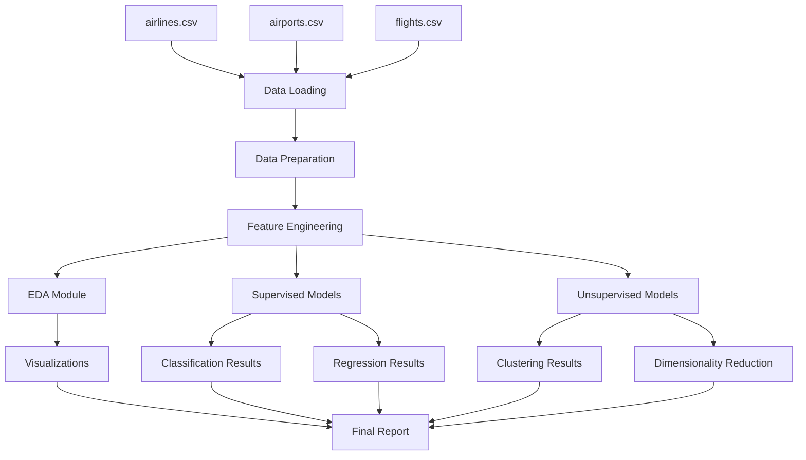

# Design Document: Flight Delay ML Analysis

## Overview

Este documento descreve o design técnico do sistema de análise e previsão de atrasos de voos nos EUA. O sistema é um projeto acadêmico de Machine Learning que implementa análise exploratória de dados (EDA), modelagem supervisionada (classificação e regressão) e modelagem não supervisionada (clusterização e redução de dimensionalidade).

### Objetivos do Sistema

O sistema tem como objetivos:

1. Carregar e preparar dados históricos de voos dos EUA (3 arquivos CSV)
2. Realizar análise exploratória para identificar padrões de atrasos
3. Construir modelos de classificação para prever se um voo vai atrasar
4. Construir modelos de regressão para estimar o tempo de atraso
5. Aplicar técnicas de aprendizado não supervisionado para descobrir padrões
6. Apresentar resultados e conclusões de forma clara e reproduzível

### Escopo e Restrições

**Escopo:**
- Análise de dados históricos de voos nos EUA
- Implementação de múltiplos algoritmos de ML (supervisionado e não supervisionado)
- Visualizações e interpretação de resultados
- Documentação em notebooks Jupyter/Colab

**Restrições:**
- Projeto acadêmico sem necessidade de deploy em produção
- Sem testes automatizados (foco em exploração e experimentação)
- Infraestrutura mínima (execução local ou Google Colab)
- Uso de bibliotecas Python padrão de ML (pandas, scikit-learn, matplotlib, seaborn)
- Dataset principal de 592 MB requer otimização de memória

### Tecnologias Principais

- **Linguagem:** Python 3.8+
- **Ambiente:** Jupyter Notebook ou Google Colab
- **Manipulação de Dados:** pandas, numpy
- **Machine Learning:** scikit-learn
- **Visualização:** matplotlib, seaborn
- **Controle de Versão:** Git/GitHub

## Architecture

### Arquitetura Geral

O sistema segue uma arquitetura de pipeline de análise de dados organizada em notebooks. A arquitetura é linear e sequencial, refletindo o fluxo típico de um projeto de ciência de dados:

```
[Data Loading] → [Data Preparation] → [EDA] → [Supervised Learning] → [Unsupervised Learning] → [Results]
```

### Organização em Notebooks

O sistema será organizado em 1-3 notebooks Jupyter, seguindo uma das seguintes estruturas:

**Opção 1: Notebook Único (Recomendado para projeto acadêmico)**
- `flight_delay_analysis.ipynb`: Contém todas as etapas do pipeline

**Opção 2: Notebooks Separados**
- `01_data_preparation_and_eda.ipynb`: Carregamento, preparação e análise exploratória
- `02_supervised_learning.ipynb`: Modelos de classificação e regressão
- `03_unsupervised_learning.ipynb`: Clusterização e redução de dimensionalidade

### Fluxo de Dados



### Módulos Conceituais

Embora implementado em notebooks, o sistema pode ser conceitualmente dividido em módulos:

1. **Data Loading Module**: Carrega os 3 arquivos CSV
2. **Data Preparation Module**: Limpeza, merge e feature engineering
3. **EDA Module**: Estatísticas descritivas e visualizações
4. **Supervised Learning Module**: Classificação e regressão
5. **Unsupervised Learning Module**: Clusterização e PCA
6. **Results Module**: Documentação de conclusões

## Components and Interfaces

### 1. Data Loading Component

**Responsabilidade:** Carregar os 3 arquivos CSV em DataFrames pandas.

**Inputs:**
- `airlines.csv` (359 bytes)
- `airports.csv` (24 KB)
- `flights.csv` (592.4 MB)

**Outputs:**
- `df_airlines`: DataFrame com informações de companhias aéreas
- `df_airports`: DataFrame com informações de aeroportos
- `df_flights`: DataFrame com dados de voos

**Funções principais:**
```python
def load_datasets(data_path: str) -> tuple[pd.DataFrame, pd.DataFrame, pd.DataFrame]:
    """Carrega os 3 arquivos CSV e retorna DataFrames."""
    pass
```

### 2. Data Preparation Component

**Responsabilidade:** Preparar dados para análise (merge, limpeza, feature engineering).

**Inputs:**
- `df_airlines`, `df_airports`, `df_flights`

**Outputs:**
- `df_prepared`: DataFrame consolidado e limpo
- `missing_values_report`: Relatório de valores ausentes

**Funções principais:**
```python
def merge_datasets(df_flights, df_airlines, df_airports) -> pd.DataFrame:
    """Faz merge dos datasets enriquecendo flights com informações de airlines e airports."""
    pass

def handle_missing_values(df: pd.DataFrame, strategy: str = 'drop') -> pd.DataFrame:
    """Trata valores ausentes conforme estratégia definida."""
    pass

def create_temporal_features(df: pd.DataFrame) -> pd.DataFrame:
    """Cria features derivadas de tempo (hora do dia, dia da semana, etc)."""
    pass

def create_delay_flag(df: pd.DataFrame, threshold: int = 15) -> pd.DataFrame:
    """Cria variável binária indicando se voo atrasou (>= threshold minutos)."""
    pass
```

### 3. EDA Component

**Responsabilidade:** Realizar análise exploratória e gerar visualizações.

**Inputs:**
- `df_prepared`: DataFrame preparado

**Outputs:**
- Estatísticas descritivas (exibidas no notebook)
- Visualizações (matplotlib/seaborn figures)

**Funções principais:**
```python
def calculate_descriptive_stats(df: pd.DataFrame) -> pd.DataFrame:
    """Calcula estatísticas descritivas para features numéricas."""
    pass

def plot_delay_distribution(df: pd.DataFrame) -> None:
    """Gera histograma da distribuição de atrasos."""
    pass

def plot_delays_by_airport(df: pd.DataFrame, top_n: int = 10) -> None:
    """Visualiza atrasos por aeroporto."""
    pass

def plot_delays_by_time(df: pd.DataFrame) -> None:
    """Visualiza padrões temporais de atrasos (hora, dia da semana, mês)."""
    pass

def plot_delays_by_airline(df: pd.DataFrame) -> None:
    """Visualiza atrasos por companhia aérea."""
    pass

def plot_correlation_matrix(df: pd.DataFrame) -> None:
    """Gera heatmap de correlação entre features numéricas."""
    pass
```

### 4. Supervised Learning Component

**Responsabilidade:** Implementar modelos de classificação e regressão.

**Inputs:**
- `df_prepared`: DataFrame preparado
- `feature_columns`: Lista de features para modelagem
- `target_column`: Coluna alvo

**Outputs:**
- Modelos treinados
- Métricas de avaliação
- Visualizações de resultados

**Funções principais:**
```python
def prepare_features_and_target(df: pd.DataFrame, 
                                 feature_cols: list, 
                                 target_col: str) -> tuple:
    """Prepara X e y para modelagem."""
    pass

def train_classification_models(X_train, y_train, X_test, y_test) -> dict:
    """Treina múltiplos modelos de classificação e retorna resultados."""
    pass

def train_regression_models(X_train, y_train, X_test, y_test) -> dict:
    """Treina múltiplos modelos de regressão e retorna resultados."""
    pass

def evaluate_classification(y_true, y_pred) -> dict:
    """Calcula métricas de classificação (accuracy, precision, recall, F1)."""
    pass

def evaluate_regression(y_true, y_pred) -> dict:
    """Calcula métricas de regressão (MAE, RMSE, R²)."""
    pass

def plot_confusion_matrix(y_true, y_pred, labels: list) -> None:
    """Gera visualização de matriz de confusão."""
    pass

def plot_feature_importance(model, feature_names: list, top_n: int = 10) -> None:
    """Visualiza importância das features."""
    pass

def plot_predictions_vs_actual(y_true, y_pred) -> None:
    """Gera scatter plot de predições vs valores reais."""
    pass
```

### 5. Unsupervised Learning Component

**Responsabilidade:** Implementar clusterização e redução de dimensionalidade.

**Inputs:**
- `df_aggregated`: DataFrame agregado por aeroporto ou rota
- `feature_columns`: Features para clustering/PCA

**Outputs:**
- Clusters atribuídos
- Componentes principais
- Visualizações

**Funções principais:**
```python
def aggregate_by_airport(df: pd.DataFrame) -> pd.DataFrame:
    """Agrega dados por aeroporto para criar features de clustering."""
    pass

def normalize_features(df: pd.DataFrame, feature_cols: list) -> pd.DataFrame:
    """Normaliza features para clustering."""
    pass

def find_optimal_clusters(X: np.ndarray, max_k: int = 10) -> int:
    """Determina número ótimo de clusters usando elbow method ou silhouette."""
    pass

def perform_clustering(X: np.ndarray, n_clusters: int) -> np.ndarray:
    """Aplica algoritmo de clustering e retorna labels."""
    pass

def apply_pca(X: np.ndarray, n_components: int = 2) -> tuple:
    """Aplica PCA e retorna componentes e explained variance."""
    pass

def plot_clusters_2d(X_reduced: np.ndarray, labels: np.ndarray) -> None:
    """Visualiza clusters em espaço 2D."""
    pass

def interpret_clusters(df: pd.DataFrame, cluster_labels: np.ndarray) -> pd.DataFrame:
    """Gera estatísticas descritivas por cluster."""
    pass
```

### 6. Results Documentation Component

**Responsabilidade:** Documentar insights, conclusões e limitações.

**Formato:** Células markdown no notebook com:
- Principais insights da EDA
- Comparação de modelos supervisionados
- Interpretação de resultados não supervisionados
- Limitações identificadas
- Propostas de melhorias futuras
- Respostas às perguntas orientadoras do projeto

## Data Models

### DataFrames Principais

#### 1. df_airlines
```python
{
    'IATA_CODE': str,      # Código IATA da companhia (ex: 'AA')
    'AIRLINE': str         # Nome completo da companhia (ex: 'American Airlines')
}
```

#### 2. df_airports
```python
{
    'IATA_CODE': str,      # Código IATA do aeroporto (ex: 'ATL')
    'AIRPORT': str,        # Nome do aeroporto
    'CITY': str,           # Cidade
    'STATE': str,          # Estado
    'COUNTRY': str,        # País
    'LATITUDE': float,     # Latitude
    'LONGITUDE': float     # Longitude
}
```

#### 3. df_flights (original)
```python
{
    # Temporal
    'YEAR': int,
    'MONTH': int,
    'DAY': int,
    'DAY_OF_WEEK': int,
    
    # Flight info
    'AIRLINE': str,
    'FLIGHT_NUMBER': int,
    'TAIL_NUMBER': str,
    'ORIGIN_AIRPORT': str,
    'DESTINATION_AIRPORT': str,
    
    # Departure
    'SCHEDULED_DEPARTURE': int,
    'DEPARTURE_TIME': int,
    'DEPARTURE_DELAY': float,
    'TAXI_OUT': float,
    'WHEELS_OFF': int,
    
    # Flight times
    'SCHEDULED_TIME': float,
    'ELAPSED_TIME': float,
    'AIR_TIME': float,
    'DISTANCE': float,
    
    # Arrival
    'WHEELS_ON': int,
    'TAXI_IN': float,
    'SCHEDULED_ARRIVAL': int,
    'ARRIVAL_TIME': int,
    'ARRIVAL_DELAY': float,
    
    # Status
    'DIVERTED': int,
    'CANCELLED': int,
    'CANCELLATION_REASON': str,
    
    # Delay types
    'AIR_SYSTEM_DELAY': float,
    'SECURITY_DELAY': float,
    'AIRLINE_DELAY': float,
    'LATE_AIRCRAFT_DELAY': float,
    'WEATHER_DELAY': float
}
```

#### 4. df_prepared (após preparação)

Inclui todas as colunas de df_flights mais:

```python
{
    # Features derivadas temporais
    'HOUR_OF_DAY': int,              # Hora do dia (0-23)
    'IS_WEEKEND': int,                # 1 se fim de semana, 0 caso contrário
    'MONTH_NAME': str,                # Nome do mês
    
    # Features derivadas de atraso
    'IS_DELAYED': int,                # 1 se ARRIVAL_DELAY >= threshold, 0 caso contrário
    'DELAY_CATEGORY': str,            # 'No Delay', 'Short', 'Medium', 'Long'
    
    # Informações enriquecidas (do merge)
    'AIRLINE_NAME': str,              # Nome completo da companhia
    'ORIGIN_CITY': str,               # Cidade de origem
    'ORIGIN_STATE': str,              # Estado de origem
    'DEST_CITY': str,                 # Cidade de destino
    'DEST_STATE': str,                # Estado de destino
    
    # Features agregadas (opcionais)
    'ROUTE': str,                     # 'ORIGIN-DESTINATION'
    'TOTAL_DELAY': float              # Soma de todos os tipos de atraso
}
```

### Estruturas de Dados para Modelagem

#### Features para Classificação/Regressão
```python
feature_columns = [
    'MONTH', 'DAY_OF_WEEK', 'HOUR_OF_DAY',
    'AIRLINE', 'ORIGIN_AIRPORT', 'DESTINATION_AIRPORT',
    'SCHEDULED_TIME', 'DISTANCE',
    'IS_WEEKEND'
]
```

#### Features para Clustering (agregadas por aeroporto)
```python
airport_features = {
    'AIRPORT_CODE': str,
    'TOTAL_FLIGHTS': int,
    'AVG_DEPARTURE_DELAY': float,
    'AVG_ARRIVAL_DELAY': float,
    'DELAY_RATE': float,              # % de voos atrasados
    'CANCELLATION_RATE': float,       # % de voos cancelados
    'AVG_DISTANCE': float,
    'TOTAL_AIRLINES': int             # Número de companhias operando
}
```

### Constantes e Configurações

```python
# Threshold para definir atraso
DELAY_THRESHOLD = 15  # minutos

# Split de dados
TEST_SIZE = 0.2
RANDOM_STATE = 42

# Clustering
MAX_CLUSTERS = 10
PCA_COMPONENTS = 2

# Visualização
FIGSIZE_DEFAULT = (12, 6)
TOP_N_AIRPORTS = 10
TOP_N_FEATURES = 10
```


## Correctness Properties

*A property is a characteristic or behavior that should hold true across all valid executions of a system-essentially, a formal statement about what the system should do. Properties serve as the bridge between human-readable specifications and machine-verifiable correctness guarantees.*

**Nota importante:** Este projeto é acadêmico e NÃO implementará testes automatizados. As propriedades abaixo servem como especificação formal do comportamento esperado do sistema, documentando as garantias que o código deve fornecer.

### Property 1: Merge preserva informações dos datasets originais

*For any* merge operation entre flights, airlines e airports, o DataFrame resultante deve conter todas as colunas relevantes dos datasets originais e o número de linhas deve corresponder ao dataset principal (flights).

**Validates: Requirements 1.2**

### Property 2: Tratamento de missing values produz resultado consistente

*For any* estratégia de tratamento de valores ausentes (removal, imputation, flagging), após aplicação:
- Se removal: nenhuma coluna tratada deve conter valores NaN
- Se imputation: valores preenchidos devem estar dentro do intervalo válido da feature
- Se flagging: uma coluna indicadora deve ser criada

**Validates: Requirements 1.4**

### Property 3: Features temporais derivadas têm valores válidos

*For any* registro no dataset preparado, as features temporais derivadas devem satisfazer:
- `HOUR_OF_DAY` ∈ [0, 23]
- `MONTH` ∈ [1, 12]
- `DAY_OF_WEEK` ∈ [1, 7]
- `IS_WEEKEND` ∈ {0, 1}

**Validates: Requirements 1.5**

### Property 4: Estatísticas descritivas seguem relações matemáticas

*For any* feature numérica, as estatísticas descritivas calculadas devem satisfazer:
- min ≤ mean ≤ max
- min ≤ median ≤ max
- std ≥ 0
- Se todos os valores são iguais, então std = 0

**Validates: Requirements 2.1**

### Property 5: Top N aeroportos estão ordenados por métrica

*For any* lista de top N aeroportos por taxa de atraso, os aeroportos devem estar ordenados em ordem decrescente de taxa de atraso, onde taxa_atraso[i] ≥ taxa_atraso[i+1] para todo i.

**Validates: Requirements 2.6**

### Property 6: Matriz de correlação tem propriedades matemáticas corretas

*For any* matriz de correlação calculada:
- A matriz deve ser simétrica: corr[i,j] = corr[j,i]
- Diagonal deve conter apenas 1.0: corr[i,i] = 1.0
- Todos os valores devem estar em [-1, 1]

**Validates: Requirements 2.7**

### Property 7: Variável target binária segue threshold definido

*For any* registro no dataset, a variável binária `IS_DELAYED` deve ser:
- 1 se `ARRIVAL_DELAY` ≥ `DELAY_THRESHOLD`
- 0 se `ARRIVAL_DELAY` < `DELAY_THRESHOLD`

**Validates: Requirements 3.1**

### Property 8: Split de dados respeita proporção mínima

*For any* split de dados em treino e teste:
- |test_set| ≥ 0.2 × |dataset_total|
- |train_set| + |test_set| = |dataset_total|
- train_set ∩ test_set = ∅ (sem sobreposição)

**Validates: Requirements 3.2**

### Property 9: Métricas de classificação estão em intervalo válido

*For any* modelo de classificação treinado, as métricas calculadas devem satisfazer:
- accuracy ∈ [0, 1]
- precision ∈ [0, 1]
- recall ∈ [0, 1]
- F1-score ∈ [0, 1]
- F1 = 2 × (precision × recall) / (precision + recall) quando precision + recall > 0

**Validates: Requirements 3.4**

### Property 10: Matriz de confusão tem propriedades válidas

*For any* matriz de confusão calculada:
- Todos os valores devem ser não negativos: CM[i,j] ≥ 0
- Soma de todos os elementos = número total de amostras: ΣΣ CM[i,j] = |test_set|
- Para classificação binária, deve ser 2×2

**Validates: Requirements 3.5**

### Property 11: Features importantes estão ordenadas por importância

*For any* lista de top N features mais importantes:
- Features devem estar ordenadas em ordem decrescente de importância
- importance[i] ≥ importance[i+1] para todo i
- Todas as features devem existir no conjunto de features usado no treinamento

**Validates: Requirements 3.7**

### Property 12: Target de regressão contém valores numéricos válidos

*For any* variável target de regressão (tempo de atraso):
- Todos os valores devem ser numéricos (float ou int)
- Valores devem ser não negativos (atraso ≥ 0) ou permitir negativos se considerando adiantamentos

**Validates: Requirements 4.1**

### Property 13: Filtro mantém apenas registros com atraso

*For any* dataset filtrado para regressão de atrasos:
- Todos os registros devem ter `ARRIVAL_DELAY` > 0 ou ≥ `DELAY_THRESHOLD`
- Nenhum registro com atraso zero ou negativo deve estar presente

**Validates: Requirements 4.2**

### Property 14: Métricas de regressão têm propriedades válidas

*For any* modelo de regressão treinado, as métricas calculadas devem satisfazer:
- MAE ≥ 0
- RMSE ≥ 0
- RMSE ≥ MAE (desigualdade de Cauchy-Schwarz)
- R² ≤ 1

**Validates: Requirements 4.4**

### Property 15: Agregação elimina duplicatas por chave

*For any* agregação de dados por aeroporto ou rota:
- Cada chave de agregação (aeroporto ou rota) deve aparecer exatamente uma vez
- Número de linhas do resultado = número de chaves únicas no dataset original

**Validates: Requirements 5.1**

### Property 16: Normalização produz distribuição esperada

*For any* conjunto de features normalizadas:
- Se standardization (z-score): mean ≈ 0 e std ≈ 1 para cada feature
- Se min-max normalization: todos os valores ∈ [0, 1]

**Validates: Requirements 5.2**

### Property 17: Número de clusters está em intervalo válido

*For any* resultado de determinação de clusters ótimos:
- n_clusters ≥ 2 (mínimo para clustering fazer sentido)
- n_clusters ≤ min(max_k, |dataset|) (não pode ter mais clusters que amostras)

**Validates: Requirements 5.4**

### Property 18: Cada registro tem cluster atribuído

*For any* resultado de clustering:
- Cada registro deve ter exatamente um cluster atribuído
- Labels de cluster devem ser inteiros em [0, n_clusters-1]
- Todos os clusters devem ter pelo menos um membro (sem clusters vazios)

**Validates: Requirements 5.5**

### Property 19: Features selecionadas para PCA são numéricas

*For any* conjunto de features selecionadas para redução de dimensionalidade:
- Todas as features devem ter dtype numérico (int ou float)
- Nenhuma feature categórica ou string deve estar presente

**Validates: Requirements 6.1**

### Property 20: Redução de dimensionalidade produz número correto de componentes

*For any* resultado de PCA ou redução de dimensionalidade:
- Número de colunas do resultado ∈ {2, 3}
- Número de linhas permanece igual ao dataset original

**Validates: Requirements 6.3**

### Property 21: Explained variance ratio tem propriedades válidas

*For any* explained variance ratio calculado:
- Cada componente deve ter variance ratio ∈ [0, 1]
- Soma de todos os variance ratios ≤ 1.0
- Componentes devem estar ordenados: variance[i] ≥ variance[i+1]

**Validates: Requirements 6.4**

## Error Handling

### Estratégia Geral

Como este é um projeto acadêmico executado em notebooks, a estratégia de error handling é simplificada e focada em:

1. **Validação de entrada**: Verificar existência e formato dos arquivos CSV
2. **Tratamento de dados ausentes**: Documentar e aplicar estratégia consistente
3. **Mensagens informativas**: Usar prints e warnings para comunicar problemas
4. **Fail-fast**: Permitir que erros críticos interrompam a execução com mensagens claras

### Cenários de Erro e Tratamento

#### 1. Erros de Carregamento de Dados

**Cenário:** Arquivo CSV não encontrado ou corrompido

**Tratamento:**
```python
try:
    df = pd.read_csv(filepath)
except FileNotFoundError:
    print(f"ERRO: Arquivo {filepath} não encontrado.")
    print("Verifique se os arquivos estão no diretório correto.")
    raise
except pd.errors.ParserError:
    print(f"ERRO: Arquivo {filepath} está corrompido ou mal formatado.")
    raise
```

#### 2. Dados Ausentes

**Cenário:** Colunas com alta porcentagem de valores ausentes

**Tratamento:**
```python
missing_pct = df.isnull().sum() / len(df) * 100
high_missing = missing_pct[missing_pct > 50]

if not high_missing.empty:
    print(f"AVISO: Colunas com >50% de valores ausentes:")
    print(high_missing)
    print("Considere remover estas colunas da análise.")
```

#### 3. Memória Insuficiente

**Cenário:** Dataset muito grande para memória disponível (flights.csv = 592 MB)

**Tratamento:**
```python
# Carregar em chunks ou usar dtypes otimizados
dtypes = {
    'YEAR': 'int16',
    'MONTH': 'int8',
    'DAY': 'int8',
    'AIRLINE': 'category',
    'ORIGIN_AIRPORT': 'category',
    # ... outros dtypes otimizados
}

try:
    df = pd.read_csv('flights.csv', dtype=dtypes)
except MemoryError:
    print("ERRO: Memória insuficiente para carregar dataset completo.")
    print("Sugestões:")
    print("1. Execute no Google Colab com mais RAM")
    print("2. Use amostragem: pd.read_csv(..., nrows=100000)")
    print("3. Carregue em chunks e processe incrementalmente")
    raise
```

#### 4. Features Inválidas para Modelagem

**Cenário:** Features categóricas não codificadas ou com cardinalidade muito alta

**Tratamento:**
```python
categorical_cols = df.select_dtypes(include=['object', 'category']).columns

for col in categorical_cols:
    n_unique = df[col].nunique()
    if n_unique > 100:
        print(f"AVISO: Coluna {col} tem {n_unique} valores únicos.")
        print(f"Considere remover ou aplicar target encoding.")
```

#### 5. Modelos que Não Convergem

**Cenário:** Algoritmo de ML não converge ou produz resultados ruins

**Tratamento:**
```python
from sklearn.exceptions import ConvergenceWarning
import warnings

warnings.filterwarnings('always', category=ConvergenceWarning)

# Durante treinamento
try:
    model.fit(X_train, y_train)
except ConvergenceWarning as w:
    print(f"AVISO: Modelo não convergiu completamente: {w}")
    print("Sugestões: aumentar max_iter ou ajustar learning_rate")
```

#### 6. Divisão de Dados Desbalanceada

**Cenário:** Classes muito desbalanceadas no target

**Tratamento:**
```python
class_counts = y.value_counts()
class_ratio = class_counts.min() / class_counts.max()

if class_ratio < 0.1:
    print(f"AVISO: Classes muito desbalanceadas (ratio: {class_ratio:.3f})")
    print("Considere:")
    print("1. Usar stratified split")
    print("2. Aplicar class_weight='balanced' nos modelos")
    print("3. Usar técnicas de resampling (SMOTE)")
```

### Validações Recomendadas

Antes de cada etapa principal, incluir validações:

```python
# Antes de EDA
assert not df.empty, "DataFrame está vazio"
assert len(df) > 1000, "Dataset muito pequeno para análise"

# Antes de modelagem
assert 'IS_DELAYED' in df.columns, "Target variable não encontrada"
assert X_train.shape[0] > 0, "Training set vazio"
assert not X_train.isnull().any().any(), "Features contêm valores ausentes"

# Antes de clustering
assert X_scaled.shape[1] >= 2, "Mínimo 2 features necessárias para clustering"
```

## Testing Strategy

### Abordagem Geral

**IMPORTANTE:** Este projeto é acadêmico e **NÃO implementará testes automatizados**. A estratégia de "testing" consiste em:

1. **Validação manual**: Executar notebooks sequencialmente e verificar outputs
2. **Inspeção visual**: Verificar visualizações e resultados impressos
3. **Validações inline**: Assertions e checks dentro do código do notebook
4. **Reprodutibilidade**: Garantir que notebooks executam sem erros

### Validação Manual por Módulo

#### 1. Data Loading e Preparation

**Validações a realizar:**
- [ ] Verificar que os 3 CSVs foram carregados com sucesso
- [ ] Inspecionar shape e dtypes de cada DataFrame
- [ ] Verificar resultado do merge (número de linhas e colunas)
- [ ] Revisar relatório de missing values
- [ ] Confirmar que features derivadas foram criadas corretamente

**Checklist de inspeção:**
```python
# Imprimir informações básicas
print(f"Airlines: {df_airlines.shape}")
print(f"Airports: {df_airports.shape}")
print(f"Flights: {df_flights.shape}")

# Verificar merge
print(f"Merged dataset: {df_prepared.shape}")
print(f"Colunas adicionadas: {set(df_prepared.columns) - set(df_flights.columns)}")

# Verificar missing values
print(df_prepared.isnull().sum())

# Verificar features derivadas
print(df_prepared[['HOUR_OF_DAY', 'IS_WEEKEND', 'IS_DELAYED']].describe())
```

#### 2. Exploratory Data Analysis

**Validações a realizar:**
- [ ] Verificar que estatísticas descritivas fazem sentido (min < mean < max)
- [ ] Inspecionar visualizações de distribuição de atrasos
- [ ] Verificar que top 10 aeroportos estão ordenados corretamente
- [ ] Revisar matriz de correlação para identificar features correlacionadas
- [ ] Confirmar que padrões temporais são visíveis nos gráficos

**Checklist de inspeção:**
```python
# Estatísticas descritivas
stats = df_prepared[numerical_cols].describe()
print(stats)

# Verificar ordenação de top aeroportos
top_airports = df_prepared.groupby('ORIGIN_AIRPORT')['IS_DELAYED'].mean().sort_values(ascending=False).head(10)
print("Top 10 aeroportos com maior taxa de atraso:")
print(top_airports)
```

#### 3. Supervised Learning (Classification)

**Validações a realizar:**
- [ ] Verificar que split de dados respeita proporção 80/20
- [ ] Confirmar que target é binário (apenas 0 e 1)
- [ ] Verificar que múltiplos algoritmos foram treinados
- [ ] Revisar métricas de cada modelo (accuracy, precision, recall, F1)
- [ ] Inspecionar matrizes de confusão
- [ ] Verificar feature importance do melhor modelo

**Checklist de inspeção:**
```python
# Verificar split
print(f"Train size: {len(X_train)} ({len(X_train)/len(X)*100:.1f}%)")
print(f"Test size: {len(X_test)} ({len(X_test)/len(X)*100:.1f}%)")

# Verificar target
print(f"Target values: {y.unique()}")
print(f"Class distribution: {y.value_counts()}")

# Comparar modelos
results_df = pd.DataFrame(classification_results)
print(results_df.sort_values('f1_score', ascending=False))
```

#### 4. Supervised Learning (Regression)

**Validações a realizar:**
- [ ] Verificar que dataset foi filtrado para apenas voos atrasados
- [ ] Confirmar que target é contínuo (tempo de atraso)
- [ ] Verificar que múltiplos algoritmos foram treinados
- [ ] Revisar métricas de cada modelo (MAE, RMSE, R²)
- [ ] Inspecionar scatter plots de predições vs valores reais
- [ ] Verificar que RMSE ≥ MAE

**Checklist de inspeção:**
```python
# Verificar filtro
print(f"Dataset original: {len(df_prepared)}")
print(f"Apenas atrasados: {len(df_delayed)}")
print(f"Min delay: {df_delayed['ARRIVAL_DELAY'].min()}")

# Comparar modelos
results_df = pd.DataFrame(regression_results)
print(results_df.sort_values('rmse'))

# Verificar relação RMSE >= MAE
for model_name, metrics in regression_results.items():
    assert metrics['rmse'] >= metrics['mae'], f"RMSE < MAE para {model_name}"
```

#### 5. Unsupervised Learning (Clustering)

**Validações a realizar:**
- [ ] Verificar que dados foram agregados por aeroporto/rota
- [ ] Confirmar que features foram normalizadas
- [ ] Revisar elbow plot ou silhouette scores
- [ ] Verificar número de clusters escolhido
- [ ] Inspecionar visualização 2D dos clusters
- [ ] Revisar interpretação de cada cluster

**Checklist de inspeção:**
```python
# Verificar agregação
print(f"Registros originais: {len(df_prepared)}")
print(f"Aeroportos únicos: {len(df_aggregated)}")

# Verificar normalização
print("Estatísticas após normalização:")
print(df_normalized.describe())

# Verificar clusters
print(f"Número de clusters: {n_clusters}")
print(f"Distribuição de amostras por cluster:")
print(pd.Series(cluster_labels).value_counts().sort_index())
```

#### 6. Unsupervised Learning (PCA)

**Validações a realizar:**
- [ ] Verificar que apenas features numéricas foram usadas
- [ ] Confirmar que resultado tem 2 ou 3 dimensões
- [ ] Revisar explained variance ratio
- [ ] Verificar que soma de variance ratios ≤ 1.0
- [ ] Inspecionar visualização 2D/3D
- [ ] Se clusters existem, verificar coloração por cluster

**Checklist de inspeção:**
```python
# Verificar PCA
print(f"Shape original: {X.shape}")
print(f"Shape após PCA: {X_pca.shape}")
print(f"Explained variance ratio: {pca.explained_variance_ratio_}")
print(f"Total variance explained: {pca.explained_variance_ratio_.sum():.3f}")

# Verificar ordenação
variances = pca.explained_variance_ratio_
for i in range(len(variances)-1):
    assert variances[i] >= variances[i+1], "Variance ratios não estão ordenados"
```

### Reprodutibilidade

Para garantir reprodutibilidade dos resultados:

```python
# Definir seeds no início do notebook
import numpy as np
import random

RANDOM_STATE = 42

np.random.seed(RANDOM_STATE)
random.seed(RANDOM_STATE)

# Usar random_state em todas as operações
train_test_split(..., random_state=RANDOM_STATE)
KMeans(..., random_state=RANDOM_STATE)
RandomForestClassifier(..., random_state=RANDOM_STATE)
```

### Documentação de Resultados

Cada seção do notebook deve incluir células markdown documentando:

1. **O que foi feito**: Breve descrição da análise/modelo
2. **Resultados principais**: Métricas, insights, padrões identificados
3. **Interpretação**: O que os resultados significam
4. **Limitações**: Problemas ou restrições identificadas

### Checklist Final de Entrega

Antes de considerar o projeto completo:

- [ ] Todos os notebooks executam sem erros do início ao fim
- [ ] Todas as visualizações são exibidas corretamente
- [ ] Resultados são consistentes entre execuções (seeds fixados)
- [ ] Documentação markdown está completa e clara
- [ ] README contém instruções de setup e execução
- [ ] requirements.txt lista todas as dependências
- [ ] Estrutura de diretórios está organizada
- [ ] Conclusões e insights estão documentados
- [ ] Limitações e melhorias futuras estão identificadas

